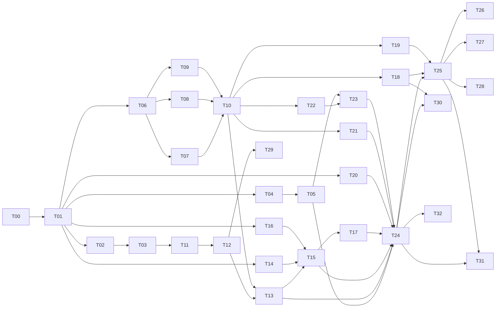

# 最小実行版の実装プラン

本文書は、Benitoite（仮称）の最小実行版の処理系を実装するための実装プランである。実装を担う LLM（以下「実装 LLM」）が、[設計書](../2026-09-27-design-initial/README.md)と本プランだけを読んで実装できるように、作業を分け、各作業の入力・出力・受け入れテスト・完了条件を定める（[ロードマップ](../2026-09-27-design-initial/00-overview/00-03-roadmap.md)の「設計から実装までの分担と進め方」）。

作業は、複数の LLM で分担できるように分けてある。各作業の担当は、下の作業一覧の難易度を見て決め、「担当」の欄に書いた（[ADR 0084](../2026-09-27-design-initial/decisions/0084-implementer-assignment-for-minimal.md)）。Claude Code がオーケストレータとして作業を配り、結果を確かめて取り込む（[作業の進め方](00-common/00-03-workflow.md)の「オーケストレータによる進め方」）。

## 構成

| 場所 | 内容 |
|---|---|
| [00-common/](00-common/) | すべての作業に共通の決まり: [リポジトリとクレートの配置](00-common/00-01-repository-layout.md)、[実装の規約](00-common/00-02-conventions.md)、[作業の進め方](00-common/00-03-workflow.md)、[実装の確認の観点](00-common/00-04-review-checklist.md) |
| [10-interfaces/](10-interfaces/) | 凍結する Rust の型と関数のシグネチャ（後述の「インターフェースの読み方」） |
| [20-tasks/](20-tasks/) | 作業ごとの文書（一作業一ファイル） |
| [90-after-completion.md](90-after-completion.md) | すべての作業を終えた後に行うこと（完了条件の確認、テストの整理、性能の測定、未決事項の決着） |
| [tools/extract_interfaces.py](tools/extract_interfaces.py) | 10-interfaces から Rust のコードを取り出す道具 |

実装 LLM は、作業を始める前に [作業の進め方](00-common/00-03-workflow.md) の「作業を始める前に読むもの」を読む。

## インターフェースの読み方

設計書の処理系設計（`02-impl/`）が定めるデータ構造を、[10-interfaces](10-interfaces/) で Rust の型の定義と主要な関数のシグネチャとして示す（07-03「実装の規約と静的な検査」）。

| 章 | 内容 |
|---|---|
| [10-01](10-interfaces/10-01-base.md) | クレートの骨組み、専用の整数の型、span、ソースの表 |
| [10-02](10-interfaces/10-02-diagnostics.md) | 診断の表現、診断コードの初めの一覧と文言の型板、診断の書き出し |
| [10-03](10-interfaces/10-03-syntax.md) | 字句、AST、字句解析と構文解析 |
| [10-04](10-interfaces/10-04-resolve.md) | 束縛の表と参照の表、名前解決 |
| [10-05](10-interfaces/10-05-types.md) | 型の表現、型検査の出力、推論の型と制約、パターンの検査 |
| [10-06](10-interfaces/10-06-ir.md) | コア IR、下位 IR、脱糖・判定の木・コア IR の検査器・参照インタプリタ |
| [10-07](10-interfaces/10-07-bytecode.md) | 命令の符号化、コンパイル済みプログラム、コード生成 |
| [10-08](10-interfaces/10-08-runtime.md) | 実行時の値、ヒープ、IO のハンドラ、VM、IO 実行器、報告、実行の流れ |
| [10-09](10-interfaces/10-09-pipeline-api.md) | パイプライン API と CLI |
| [10-10](10-interfaces/10-10-builtins.md) | 組み込みの関数の一覧と組み込みの表 |
| [10-11](10-interfaces/10-11-prelude-source.md) | prelude のソースの全文 |

コードブロックの見出しは二種類ある。パスは処理系のクレート `crates/benitoite/` からの相対パスである。

- `rust file=<パス>`（prelude のソースは `text file=<パス>`）: 作業 T01 が、そのまま置くコード。以後の作業は変えない。
- `rust sig=<パス>`: 後の作業が中身を書く関数のシグネチャ（`;` で終わる宣言）と、その作業が置く型。シグネチャは変えない。

同じパスに `file=` と `sig=` の両方があるときは、`file=` のコードの後に、`sig=` の作業がそのファイルに関数の中身を書き足す。

本プランの作成者（Claude Code）は、`tools/extract_interfaces.py check` で、すべての `file=` のコードと、本体を仮に埋めた `sig=` のシグネチャが、Rust 1.98.1 と 00-02 の lint の設定でコンパイルできることを確かめた（2026-09-27）。`place` の出力も、警告なしでコンパイルと Clippy を通る。

## 難易度の目安

各作業の難易度は、次の 5 段階で示す。担当を決める材料であり、特定の LLM がどの段階まで担えるかは定めない。

| 難易度 | 目安 |
|---|---|
| 1 | 定型の作業。書く内容が本プランにほぼ書いてある（設定、写すだけ） |
| 2 | 設計書の規則を読めば一通りに書ける。アルゴリズムは単純で、境界の場合が少ない |
| 3 | 設計書の規則の細部が多く、境界の場合を取りこぼしやすい。アルゴリズムは標準的 |
| 4 | 自明でないアルゴリズムを書くか、複数の章の規則を突き合わせる必要がある。誤りが後の段で初めて表に出ることがある |
| 5 | 微妙なアルゴリズムで、誤りがテストで見つけにくく、ほかの多くの作業の正しさを左右する |

## 作業一覧

「規模」は、テストを含む Rust の行数の見込み（小: 500 行未満、中: 500〜1500 行、大: 1500 行超）である。「担当」の略号は、Opus（medium）と Opus（low）が推論の度合いを medium と low にした Claude Opus 5.5 のサブエージェント、Codex が Codex と GPT-6-Luna（推論の度合い max）の組み合わせである（00-03「担当と起動の方法」）。「状態」の欄は、オーケストレータ（Claude Code）が更新する（00-03「作業の状態」）。

| ID | 作業 | 依存する作業 | 難易度 | 規模 | 担当 | 状態 |
|---|---|---|---|---|---|---|
| T00 | [土台（リポジトリの設定と検査のスクリプト）](20-tasks/T00-foundation.md) | — | 1 | 小 | Codex | 完了 |
| T01 | [型の定義を置く](20-tasks/T01-interfaces.md) | T00 | 1 | 大 | Codex | 完了 |
| T02 | [字句の切り出し](20-tasks/T02-lexer.md) | T01 | 3 | 中 | Opus（low） | 完了 |
| T03 | [改行の判定](20-tasks/T03-newlines.md) | T02 | 2 | 小 | Opus（low） | 完了 |
| T04 | [ソースの読み込みと行と列の変換](20-tasks/T04-source.md) | T01 | 2 | 小 | Codex | 完了 |
| T05 | [診断の書き出し](20-tasks/T05-diag-render.md) | T04 | 2 | 中 | Codex | 完了 |
| T06 | [実行時の値とヒープ](20-tasks/T06-values-heap.md) | T01 | 3 | 中 | Codex | 完了 |
| T07 | [組み込み関数: 数値と文字と演算子](20-tasks/T07-builtins-numeric.md) | T06 | 3 | 中 | Codex | 完了 |
| T08 | [組み込み関数: 文字列](20-tasks/T08-builtins-string.md) | T06 | 3 | 中 | Codex | 完了 |
| T09 | [組み込み関数: リスト](20-tasks/T09-builtins-list.md) | T06 | 2 | 中 | Codex | 完了 |
| T10 | [組み込みの表とテスト用のハンドラ表](20-tasks/T10-builtin-table.md) | T07, T08, T09 | 2 | 中 | Codex | 完了 |
| T11 | [構文解析 1: 基盤・宣言・型・パターン・文](20-tasks/T11-parser-decls.md) | T03 | 4 | 大 | Opus（medium） | 完了 |
| T12 | [構文解析 2: 式](20-tasks/T12-parser-exprs.md) | T11 | 4 | 中 | Opus（medium） | 完了 |
| T13 | [名前解決](20-tasks/T13-resolver.md) | T12, T10 | 3 | 大 | Opus（low） | 完了 |
| T14 | [型検査 1: 制約を解く部分](20-tasks/T14-typeck-solver.md) | T01 | 5 | 大 | Opus（medium） | 完了 |
| T15 | [型検査 2: 制約の生成と宣言の検査](20-tasks/T15-typeck-generate.md) | T13, T14, T16 | 5 | 大 | Opus（medium） | 完了 |
| T16 | [型検査 3: パターンの検査](20-tasks/T16-typeck-patterns.md) | T01 | 4 | 中 | Opus（medium） | 完了 |
| T17 | [脱糖](20-tasks/T17-desugar.md) | T15 | 4 | 大 | Opus（medium） | 完了 |
| T18 | [コア IR の検査器](20-tasks/T18-core-check.md) | T10 | 3 | 中 | Opus（low） | 完了 |
| T19 | [参照インタプリタ](20-tasks/T19-refinterp.md) | T10 | 3 | 中 | Opus（low） | 完了 |
| T20 | [判定の木への変換](20-tasks/T20-decision-tree.md) | T01 | 4 | 中 | Opus（medium） | 完了 |
| T21 | [コード生成](20-tasks/T21-codegen.md) | T10 | 4 | 大 | Opus（medium） | 完了 |
| T22 | [仮想機械](20-tasks/T22-vm.md) | T10 | 4 | 大 | Opus（medium） | 完了 |
| T23 | [ランタイム](20-tasks/T23-runtime.md) | T22, T05 | 3 | 大 | Opus（low） | 完了 |
| T24 | [パイプライン API と CLI](20-tasks/T24-pipeline-cli.md) | T05, T13, T15, T17, T20, T21, T23 | 2 | 中 | Codex | 完了 |
| T25 | [ゴールデンテストの実行器](20-tasks/T25-golden-runner.md) | T24, T18, T19 | 3 | 中 | Codex | 完了 |
| T26 | [テストの作成: 字句・構文・名前](20-tasks/T26-tests-front.md) | T25 | 2 | 中 | Codex | 完了 |
| T27 | [テストの作成: 型・エフェクト・パターン](20-tasks/T27-tests-types.md) | T25 | 3 | 中 | Codex | 完了 |
| T28 | [テストの作成: 評価・IO・受け入れ](20-tasks/T28-tests-eval.md) | T25 | 2 | 中 | Codex | 完了 |
| T29 | [言語仕様の例を処理系で読む検査](20-tasks/T29-spec-examples.md) | T12 | 2 | 小 | Codex | 完了 |
| T30 | [fuzzing](20-tasks/T30-fuzz.md) | T24, T18 | 2 | 小 | Codex | 完了 |
| T31 | [ベンチマーク](20-tasks/T31-bench.md) | T24, T25 | 2 | 中 | Codex | 完了 |
| T32 | [最小限の言語リファレンス](20-tasks/T32-language-reference.md) | T24 | 2 | 小 | Codex | 完了 |

## 依存の関係

矢印は「左の作業が終わってから右の作業を始める」を表す。

同時に進められる作業の組は、次のとおりである。同じ段の作業は、互いに依存しない。

| 段 | 作業 |
|---|---|
| 1 | T00 → T01 |
| 2 | T02, T04, T06, T14, T16, T20 |
| 3 | T03, T05, T07, T08, T09 |
| 4 | T10, T11 |
| 5 | T12, T18, T19, T21, T22 |
| 6 | T13, T23, T29 |
| 7 | T15 |
| 8 | T17 |
| 9 | T24 |
| 10 | T25, T30, T32 |
| 11 | T26, T27, T28, T31 |

最も長い依存の列は、T00 → T01 → T02 → T03 → T11 → T12 → T13 → T15 → T17 → T24 → T25 → T26〜T28 である。型検査の制約を解く部分（T14）、パターンの検査（T16）、判定の木への変換（T20）は T01 の型だけに、コア IR の検査器（T18）、参照インタプリタ（T19）、コード生成（T21）、VM（T22）は組み込みの表（T10）までに依存させた。どれも手で組んだ入力でテストするので、フロントエンドと並行して進められる。

## 名前を変えるとき

本プランは、言語の名前・コマンドの名前・拡張子を仮称（`Benitoite`、`benitoite`、`.bnt`）で書き、設計者は最小実行版を仮称のまま実装することを承認した（[OPEN-011](../2026-09-27-design-initial/open-issues.md#open-011)）。正式名称を決めて変えるときは、本プランと処理系とテストの `benitoite`・`Benitoite`・`BENITOITE_`・`.bnt` を一括で置き換え、`scripts/check.sh` が通ることを確かめる。

## 本プランで決めたこと

設計書が「実装プランで定める」とした事項を、次の箇所で決めた。

| 事項 | 設計書 | 決めた箇所 |
|---|---|---|
| 実装プランの置き場所とディレクトリの配置 | ADR 0040、07-03 | [00-01](00-common/00-01-repository-layout.md) |
| 測定記録の置き場所 | 07-02「測定の環境と記録」 | [00-01](00-common/00-01-repository-layout.md)（`tools/bench/results/`） |
| grammar-check の置き場所の見直し | 07-03「言語仕様の例の検査」 | [00-01](00-common/00-01-repository-layout.md)（`tools/grammar-check/` のまま） |
| Rust の版と、警告を誤りにする方法 | 07-03「実装の規約と静的な検査」 | [00-02](00-common/00-02-conventions.md)（1.98.1、`build.warnings = "deny"`） |
| 依存するクレート | 07-03 | [00-02](00-common/00-02-conventions.md)（なし。fuzzing だけ `libfuzzer-sys`） |
| 命令の種類ごとの番号と分岐表の形 | 02-07「命令」 | [10-07](10-interfaces/10-07-bytecode.md) |
| 定数から作った値を使い回すか | 02-07「値の移し方」 | [10-07](10-interfaces/10-07-bytecode.md)（`String` と原型の定数だけ使い回す） |
| 診断コードの初めの一覧 | 02-10「診断コード」 | [10-02](10-interfaces/10-02-diagnostics.md) |
| prelude のソースの全文 | 03-06「prelude のソースの書き方」 | [10-11](10-interfaces/10-11-prelude-source.md) |
| CLI の別プロセスのテストで panic を起こす手段 | 07-03「前提」 | [10-09](10-interfaces/10-09-pipeline-api.md)（`BENITOITE_DEV_PANIC`） |
| fuzzing の道具と nightly の扱い | 07-03「fuzzing」 | [T30](20-tasks/T30-fuzz.md) |
| CPU プロファイルの道具 | 07-02「測る項目」 | [T31](20-tasks/T31-bench.md) |
| ゴールデンテストの呼び出しの上限の指定（`<名前>.opts`）と表示名（`<区分>/<名前>.bnt`） | 07-03「ゴールデンテスト」の表に加える | [T25](20-tasks/T25-golden-runner.md) |
| 確保の統計の出力（`BENITOITE_DEV_ALLOC_STATS`） | 07-02「測る項目」 | [10-09](10-interfaces/10-09-pipeline-api.md) |
| 最小限の言語リファレンスの置き場所と書く言語 | 00-03 ロードマップ「最小実行版」の「文書」 | [T32](20-tasks/T32-language-reference.md) |

## 実装の途中で改めたこと

実装と確認の中で、本プランや設計書の記述が食い違っている、または足りないと分かった事項を、次のように改めた。本プランの各文書は改めた後の内容で書いてある。プランと処理系の食い違いを見つけたら、まずこの表で理由を確かめる。

| 事項 | きっかけ | 改めた内容 | 記録 |
|---|---|---|---|
| パターンの節を入れ子の深さに数える | T20 の確認で、判定の木の深さがパターンの節の数に比例し、入れ子の深さの上限で抑えられないと分かった | 一つの `match` のパターンの節を行きがけ順に数え、その番号を深さの上限 1000 の対象にする（T11・T12 の文書も改めた） | [ADR 0086](../2026-09-27-design-initial/decisions/0086-pattern-nodes-count-toward-nesting-limit.md) |
| 検査と実行の前段を大きなスタックのスレッドで行う | T15 で、上限いっぱいの入れ子で各段のスタックの使用量が、最適化しないビルドの既定のスタック（2 MiB）に近いか超えると分かった | パイプラインの公開の関数が 64 MiB のスタックのスレッドで段を実行し、panic は呼び出し側で起こし直す。あわせて型検査の制約を解く部分の 1 段あたりのスタックを減らした（T14s）。各段の単体テストは既定のスタックのまま | [ADR 0087](../2026-09-27-design-initial/decisions/0087-pipeline-stages-on-large-stack-thread.md)、[T24](20-tasks/T24-pipeline-cli.md) |
| `check_args` の誤りの型 | T23 で、10-08 のシグネチャが Clippy の `result_large_err` に当たった | 戻り値を `Result<Vec<String>, Box<Diagnostic>>` に改めた（設計者の判断） | [10-08](10-interfaces/10-08-runtime.md) |
| E0304 の型板の冠詞 | T13 の実装担当が、`is a effect` のように冠詞が合わないと指摘した | 型板から冠詞を外し、種類の呼び名の側に冠詞を含める | [10-02](10-interfaces/10-02-diagnostics.md)、[T13](20-tasks/T13-resolver.md) |
| `SWITCH` の分岐表の番号の幅 | T21 の確認で、16 ビットに収めるとした上限に対応する処理系の制限の診断がないと分かった | `CLOSURE` の原型の番号と同じく 32 ビットの `Bx` をそのまま使い、上限を設けない。命令の符号化は変わらない | [10-07](10-interfaces/10-07-bytecode.md) |
| 誤りの要素を持てない並びの回復 | T11 の確認で、型パラメータ・引数・構成子の並びは 10-03 の型が誤りの要素を持てないと分かった | 回復した後に失敗した要素を捨てる | [T11](20-tasks/T11-parser-decls.md) |
| プレースホルダの誤りの例 | T12 の実装担当が、`f(g(_) + 1)` の `_` は正しいプレースホルダだと指摘した | E0204 の例を `f(_ + 1)` に改めた | [T12](20-tasks/T12-parser-exprs.md) |
| E0104 の修正案の範囲 | T26 のテストで、T02 の文書が 02-03「字句」と食い違っていると分かった | エスケープの修正案を文字列・文字リテラルの中の場合に限る | [T02](20-tasks/T02-lexer.md) |
| 作業の文書のパスの基準 | T29 の実装担当が、統合テストのパスの基準が曖昧だと指摘した | `src/`・`tests/`・`testdata/` で始まるパスはクレートからの相対、それ以外はリポジトリの根からの相対とした | [00-03](00-common/00-03-workflow.md) |
| ゴールデンテストの実行器の `Ok(())` の判定 | T27 のテストで、`Result` を返す `main` の差分テストが失敗した | 参照インタプリタの結果の `Ok` の引数が `()` であることを照合する（実行器の不具合の修正） | `crates/benitoite/tests/golden.rs` |
| 仕様の網羅の道具の読み込み | T26 の実装担当が、正しくない UTF-8 と BOM を含むテストの印を集められないと指摘した | バイトで読み、読めないバイトを置き換え、先頭の BOM を除いてから印を探す | `tools/spec-coverage/spec_coverage.py` |
| eval のベンチマークの形 | 性能の測定で、式の深さを入力にすると CPython の再帰の上限に先に達した | 深さを固定した式を、入力の回数だけ評価する形に全言語の版をそろえて改めた | [90](90-after-completion.md)「性能の測定」 |
| リポジトリの配置 | 性能の測定の後の見直し（Cargo のワークスペースの慣例に合わせる） | 処理系のクレートを `src/benitoite/` から `crates/benitoite/` に、開発の道具を `src/tools/` と `bench/` から `tools/` に移した | [00-01](00-common/00-01-repository-layout.md) |
